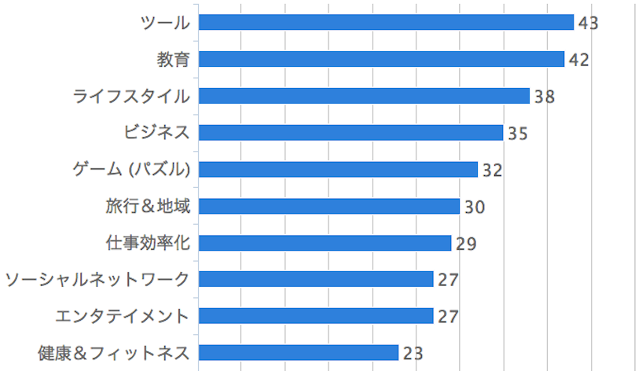
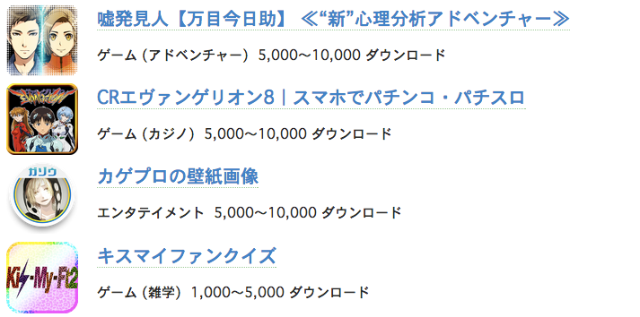

## Cordova アプリの
## 実態調査

---
#### 自己紹介
## ひらとり

- html5j Webプラットフォーム部 
- Firefox OS コミュニティ

---
### 今日のお話

- 実際に公開されている Cordova/PhoneGap アプリがどんな感じか見てみた。
- 対象: PhoneGap 公式サイトの登録アプリ、Google Play の Android アプリ。

---
### 動機

- 「ハイブリッドアプリは銀の弾丸ではない」と言われる。
	<!-- .element: class="fragment" -->
- 実際作ってみると、まぁまぁ大変、、、
	<!-- .element: class="fragment" -->
- ハマりどころも多いらしい。
	<!-- .element: class="fragment" -->
- ハイブリッド向きでないアプリを作ろうとすると痛い目に。。。
	<!-- .element: class="fragment" -->

---

- では、どんなアプリがハイブリッドに向いているのか？
- 適材適所があるはず。。。
- 実際に公開されているアプリを見てみよう！
	<!-- .element: class="fragment" -->

---
### 1. プラットフォームを見てみる
(Android, iOS, Windows Phone, etc.)

---
PhoneGap 公式サイトのアプリページ
<http://phonegap.com/app/> 

---
各アプリの対象プラットフォームの情報がある。

この情報をもとにグラフにしてみました。
	<!-- .element: class="fragment" -->

---
#### PhoneGap アプリ 681 個
#### 対象プラットフォーム

---
### 発見

- 実は、Android 単体、iOS 単体もけっこう多い。
- ハイブリッドアプリを採用する理由はクロスプラットフォームだけではない。
	<!-- .element: class="fragment" -->

---
### 2. アプリのカテゴリを見てみる

---
### PhoneGap 公式サイトに登録された
### Android アプリのカテゴリ情報
### → Google Play から引っ張ってくる<!-- .element: class="fragment" -->

---
### カテゴリ: 1 - 10 位

---
### カテゴリ: 11 - 20 位

---
### カテゴリ: 21 位〜

---
### やっぱりゲームは苦手。。。

---
## 各カテゴリのアプリの例

---
##### アプリ例: カテゴリ 1 - 3位

---
##### インド？イスラム？

---
##### アプリ例: カテゴリ 4 - 6位

---
##### これもインド？

---
##### アプリ例: カテゴリ 7 - 9位

---
##### ここにも、また・・・

---
##### アプリ例: カテゴリ 10位

### やっと親しみあるものが。。。<!-- .element: class="fragment" -->

---
### 予想以上にエキゾチック。。。
### 日本のアプリも知りたい！！！ <!-- .element: class="fragment" -->

---
### 3. Google Play で Cordova アプリを探してみる

---
### 探しかた

- Google Play 全 46 カテゴリのトップ 60 位まで。 
	<!-- .element: class="fragment" -->
- 重複を除く 2604 個。
	<!-- .element: class="fragment" -->
- そのうち apk をダウンロードできた 2430 個。
	<!-- .element: class="fragment" -->
- cordova\*.js\*, phonegap\*.js\*, monaca\*.js\* を含むアプリを探す。
	<!-- .element: class="fragment" -->

---
## 結果

<h3>Cordova アプリは 2430 個中 <b>24</b> 個。</h3>
### 約 1 % (0.99 %) <!-- .element: class="fragment" -->

---
### 見つかったアプリ

---
### 見つかったアプリ

---
### 見つかったアプリ

---
### 見つかったアプリ

---
### (参考) monaca アプリ

---
### (参考) HTML ファイルを含むアプリを探してみる

### 2430 個中 667 個。<!-- .element: class="fragment" -->
### 27.45% のアプリがハイブリッド的な側面を持つ可能性。<!-- .element: class="fragment" -->

---
### 感想
- Cordova アプリ、けっこう少ない？
- トップから探しても見つかりにくい？

---
### ハイブリッドの利点
### 開発期間・開発コストを抑えて
### サクっと作れる。
#### (対ネイティブ比較)

---
### ハイブリッドに向かなそうなもの
1. パフォーマンス的にシビア。UX の要求が高い。<!-- .element: class="fragment" -->
2. プラットフォーム固有機能の多用。<!-- .element: class="fragment" -->
	- 通知やプッシュ。<!-- .element: class="fragment" -->
	- バックグラウンド処理、他アプリとの連携。<!-- .element: class="fragment" -->
	- システム情報の取得。<!-- .element: class="fragment" -->

 

### → Cordova Core API 外の機能。<!-- .element: class="fragment" -->
### トップアプリはこういう凝ったのが多そう。<!-- .element: class="fragment" -->

---
### おまけ
#### よく使われている Cordova Plugin を調べてみた

---
#### 時間がなくなりそうなので、続きは Web で。
#### <http://flatbird.github.io/2014/06/10/cordova/>

---
### ご清聴ありがとうございました

